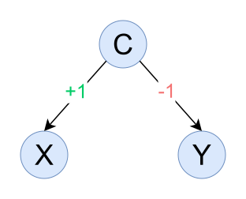

# Causal Search for Skylines (CSS): Causally-Informed Selective Data De-Correlation

This repository contains the implementation of Causal Search for Skylines (CSS), as described in our paper submitted to SIGMOD 2026.

## File Structure

### `/skylines/__init__.py`

Contains all configurations for the experiment setup.

### `/skylines/dataset/`

Contains all datasets used for experiments.

- `synthetic/`: Contains data sets for experiment with synthetic causal graphs; including the causal graphs, preference attribute sets, dominance criteria, and scripts to generate the synthetic data.
- `real/`: Contains data sets for experiments with real-world causal graphs; including the causal graphs, preference attributes sets, dominance criteria, and scripts to generate the (augmented) real-world data.
- `real/data/`: Contains raw unaugmented data files for real-world datasets in tabular CSV format, where rows represent tuples and columns represent variables.

### `/skylines/heuristic/`

Contains implementations of heuristics for finding best conditioning set.

- `algorithm0.py`: Contains implementation of the `ddSkyline` heuristic.

- `algorithm4.py`: Contains implementation of the `gnSkyline` heuristic.

- `algorithm4_leaky.py`: Contains implementation of the `lnSkyline` heuristic.

### `/skylines/skyline/`

Contains implementations naive and causal versions of all skyline algorithms using in our experimentation.

- `bnl/`: Implementation of naive and causal versions of Block Nested Loop (BNL) algorithm.

- `sfs/`: Implementation of naive and causal versions of Sort-Filter-Skyline (SFS) algorithm.

- `salsa/`: Implementation of naive and causal versions of Sort and Limit Skyline algorithm (SaLSa).

- `dnc/`: Implementation of naive and causal versions of Divide and Conquer (D&C) skyline algorithm.

- `bbs/`: Implementation of naive and causal versions of Branch and Bound Skyline (BBS) algorithm.

### `/skylines/experiment/core/`

Contains the core code for execution of the experiments.

- `benchmark.py`: Creates dataset instances based on the configuration and executes the skyline experiments.
- `summarize.py`: Summarize the executed skyline experiments for further analysis.
- `gain.py`: Creates dataset instances and compare the time required to execute `ddSkyline`, `gnSkyline`, and `lnSkyline`.

In all these experiments, `Gain 0` refers to `ddSkyline`, `Gain 4` refers to `gnSkyline`, and `Leaky Gain 4` refers to `lnSkyline`. The leakage parameters defined in `/skylines/__init__.py` will be used by `lnSkyline`.

### `/skylines/common/`

Contains definition of various common boilerplate code.

`/constants`: Defines constants used for the experiments including definition of all experiment sets.

`/kmeans`: Implementation of K-Means algorithm.

`/utils`: Defines various common utility methods.

## Causal Graphs

As mentioned before, datasets are defined inside `/skylines/dataset/`.

A typical dataset definition looks like the following:

    class XY_C_1(SyntheticDataset):

        def __init__(self,
                    dominance: dict[str, Dominance] = None,
                    size: int = 10000,
                    seed: int = 42):
            super().__init__(control=['C'],
                            preference=['X', 'Y'],
                            effect={'X': {'C':  1},
                                    'Y': {'C': -1}},
                            dominance=dominance,
                            infer_controls={
                                'X': Dominance.MAX,
                                'Y': Dominance.MAX
                            },
                            size=size,
                            seed=seed)

The causal graph is encoded using a weighted directed adjacency map, in the following block of code:

    effect={'X': {'C':  1},
            'Y': {'C': -1}},

What this specifies is variate `C` affects variate `X` with a causal strength of `+1`. Further, variate `C` also affects variate `Y` with a causal strength of `-1`.

A Directed Acyclic Graph (DAG) representation of this structure will be:

The causal graph of any dataset defined in our experiments can be interpreted in the same manner.

## Requirements

The experiments were run using Python 3.12.7 using a conda environment. The process to set up the environment is defined below.

### Installing Miniconda

Install miniconda from 
[https://www.anaconda.com/docs/getting-started/miniconda/install](https://www.anaconda.com/docs/getting-started/miniconda/install).

### Creating environment

Create the conda environment based on the provided `environment.yml` file using the following command:

    conda env create -f environment.yml

This will create a new conda environment name `skyline`.

### Activating conda environment

In order to use the `skyline` conda environment, activate it using the following command:

    conda activate skyline

## How to Run

### Configure the experiment setup

The experiments are configured through the `skylines/__init__.py` file.

    """ Number of tuples """
    n_samples = 200_000

    """ Number of runs for each experiment (to ensure stability) """
    n_runs = 5

    """ Number of clusters """
    n_bins = 10

    """ Leakage parameter (lambda_open, lambda_blocked) """
    leakage = (0.6, 0.4)

    """ Find conditioning attribute set using data-driven algorithm """
    data_driven = False

    """ Preference attribute set based decorrelation """
    complete_decorrelation = False

    """ Infer causal graph from the data """
    infer_graph = False

    """ Skip inference of causal graph and best control sets """
    skip_inference = False

    """ Choose baseline if gain <= 0 """
    skip_gain_le_zero = False

    """ Experiment type to run (enable only one line below) """
    # experiment_type = 'Synthetic (Z != P)'
    # experiment_type = 'Synthetic (Z = P)'
    # experiment_type = 'Real (Z != P)'
    # experiment_type = 'Real (Z = P)'

### Run skyline computation experiments

These experiments execute skyline queries using both the non-causal version and causal version of the skyline algorithms, and reports both the number of dominance checks and execution time.

To run the experiment use the following command:

    python -m skylines.experiment.core.benchmark

To summarize the experiment results use the following command:

    python -m skylines.experiment.core.summarize

### Run gain computation experiments

These experiments report the time required to find the best possible conditioning attribute set based on the heuristics proposed in the paper.

To run the experiment use the following command:

    python -m skylines.experiment.core.gain

### Generate inferred causal graphs using NO-TEARS

This script generates the inferred causal graphs using NO-TEARS algorithm. It is manadatory to run this script to build the cache of causal graphs before using `infer_graph = True`.

To run the experiment use the following command:

    python -m skylines.experiment.core.graph
